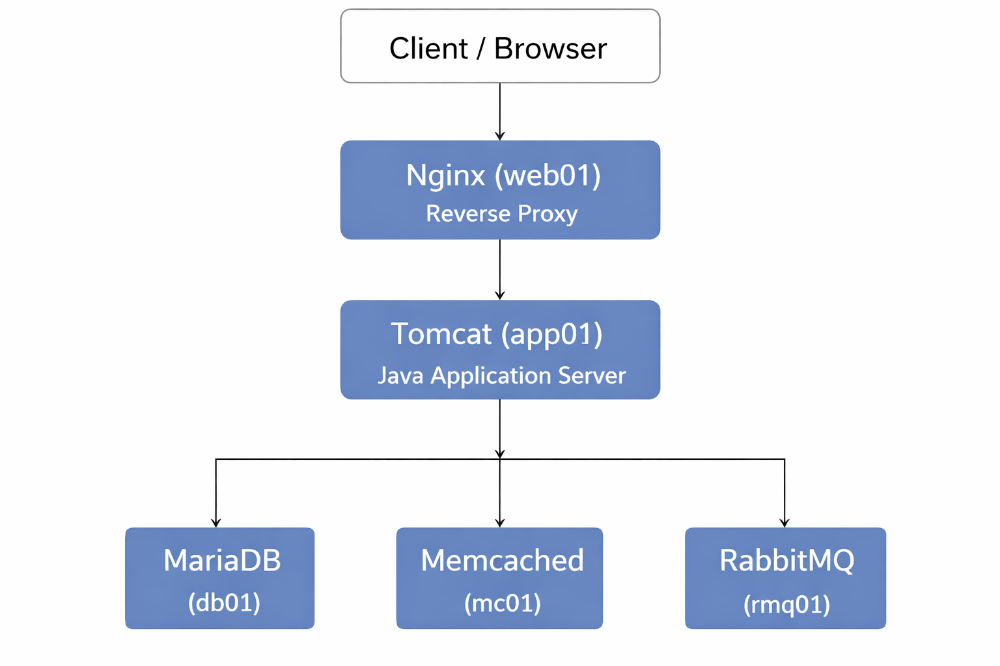

# DevOps Multi-Tier Application (Local Vagrant Lab)

A production-style multi-tier web application deployed locally using Vagrant and automated shell provisioning.

This project demonstrates infrastructure provisioning, service orchestration, and operational validation across multiple Linux hosts, simulating a real-world backend architecture.

---

## Architecture Overview

---

## Stack Components

- Nginx (Reverse Proxy) — web01 (Ubuntu 22.04)
- Tomcat (Java App Server) — app01 (CentOS Stream 9)
- MariaDB / MySQL (Database) — db01 (CentOS Stream 9)
- Memcached (User Cache) — mc01 (CentOS Stream 9)
- RabbitMQ (Message Broker) — rmq01 (CentOS Stream 9)

---

## Repository Structure

.
├── README.md
├── VERIFY.md
├── KNOWN_ISSUES.md
├── Makefile
├── pom.xml
├── src/
│   └── main/
│       └── java/
│           └── application source code
└── vagrant/
    └── automated/
        ├── Vagrantfile
        ├── application.properties
        ├── mysql.sh
        ├── memcache.sh
        ├── rabbitmq.sh
        ├── tomcat.sh
        ├── nginx.sh
        └── backend.sh

---

## Prerequisites

- Vagrant
- VirtualBox
- Git
- Minimum 8 GB RAM recommended

Tested on Windows (Git Bash / PowerShell), macOS, and Linux hosts.

---

## How to Run

Bring up the full environment:

vagrant up

This will:
- Create all virtual machines
- Provision system services
- Build and deploy the Java application
- Configure service-to-service communication

Check VM status:

vagrant status

---

## Application Access

Once provisioning completes, access the application via browser:

http://web01

---

## Verification & Validation

A complete verification guide is available in:

VERIFY.md

It covers:
- Service health checks
- Port validation
- Inter-service connectivity
- End-to-end application testing
- Failure simulation

---

## Known Issues & Lessons Learned

Documented provisioning issues, fixes, and lessons learned are available in:

KNOWN_ISSUES.md

---

## DevOps Practices Demonstrated

- Automated infrastructure provisioning
- Idempotent shell scripts
- systemd-managed services
- Multi-tier service integration
- Troubleshooting distributed systems
- Clear operational documentation

---

## Cleanup

To destroy all virtual machines and free resources:

vagrant destroy -f

---

## Future Improvements

- Replace shell provisioning with Ansible
- Add CI pipeline (Jenkins or GitHub Actions)
- Introduce secrets management
- Add observability (metrics and logs)
- Containerized deployment variant

---

## Author

Marcelo M. Boldo  
DevOps / Cloud Engineering Portfolio Project
